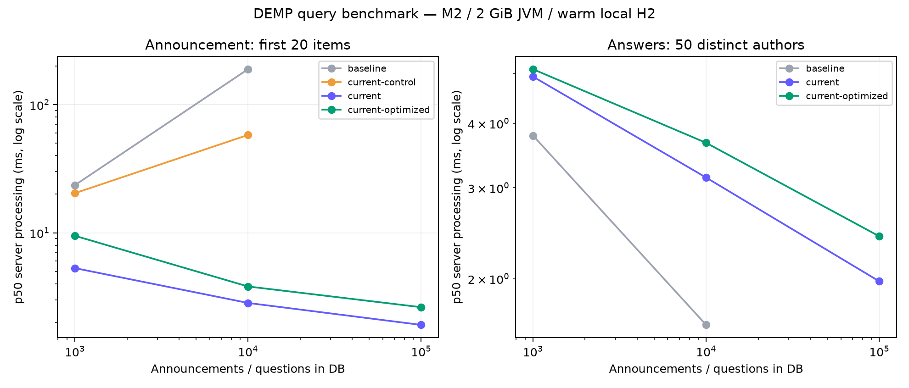
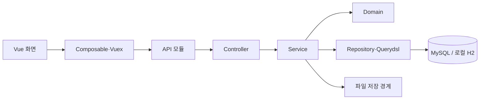

# DEMP

### 흩어진 개발자 채용·교육 정보를 비교하고, 궁금한 것은 함께 묻는 곳

채용 공고와 교육 과정은 모집 대상, 기술, 비용, 기간이 제각각입니다. DEMP는 운영자가 출처를 확인한 공고의 핵심 조건을 같은 형식으로 보여줍니다. 사용자는 조건을 좁혀 비교하고 **지원하기**에서 원본 페이지로 이동합니다. 질문·답변 공간에서는 학습 경험을 나누고 추천·비추천을 남길 수 있습니다.

[화면 보기](#서비스-둘러보기) · [기술적 문제 해결](#기술적-문제-해결) · [로컬 실행](#로컬-실행) · [검증](#검증) · [프런트엔드 저장소](https://github.com/seungmin-park/dempfrontend)

## 서비스 둘러보기

| 흐름 | 사용자가 하는 일 | 서비스가 지키는 기준 |
| --- | --- | --- |
| 채용 탐색 | 신입·경력·무관, 직무·기술 등으로 좁히고 상세 조건을 확인 | 연봉은 제공된 공고에만 상세 표시; 지원은 원본 URL에서 진행 |
| 교육 탐색 | 방식·지역·기간·비용·지원 대상 등으로 교육 과정 비교 | 기수·지원금·마감 정보를 분리하고 조건에 맞는 결과가 없으면 이유와 초기화 경로 안내 |
| 질문·답변 | Markdown으로 작성하고 태그로 찾고 추천·비추천·취소 | 회원별 선택과 집계를 저장하고 새로고침 뒤에도 복원 |
| 운영 | 공고를 초안→검토→공개→마감/비공개로 관리 | 출처·확인일·변경 이력과 오류 제보를 남기고 관리자 권한 검사 |

<p align="center">
  
  
</p>

위 화면은 로컬 예제 데이터로 촬영했습니다. [게시 운영 화면](docs/verification/publication-workflow/assets/education-publication.png)과 [상황별 빈 목록 안내](docs/verification/education-discovery/assets/education-empty.png)도 확인할 수 있습니다.

공고는 **운영자 큐레이션** 방식입니다. 원문 전체를 복제하거나 외부 이미지를 자동 수집하지 않습니다. 이미지는 선택적으로 업로드하며 기본 이미지로도 게시할 수 있습니다. [게시·이미지 정책](docs/plans/curated-publication-policy.md)

## 기술적 문제 해결

### 1. 스크롤 한 번에 공고 전체를 읽던 조회

기존 컬렉션 fetch join에 offset/limit를 걸면 Hibernate가 공고를 모두 읽은 뒤 메모리에서 페이지를 잘랐습니다. 사용자는 20개만 요청했는데 1만 건을 읽는 구조였습니다.


현재는 **페이지 크기+1개의 ID**를 먼저 가져오고 필요한 상세만 읽습니다. 추가 1개로 `hasNext`를 판단합니다. 1만 건 실험에서 같은 20개 응답의 로딩 엔티티는 **10,001→21개**였습니다. 질문 목록도 전체 배열에서 20개 Slice 응답으로 바꿨습니다. [쿼리와 실행 결과](docs/verification/measured-query-performance/README.md)

### 2. 추천 수와 회원별 선택을 함께 저장하기

추천 버튼을 두 번 누르거나 다른 요청이 동시에 들어와도 집계가 틀어지지 않아야 합니다.

```text
인증 회원 + 원하는 상태
  → 질문/답변 행 잠금
  → 이전 선택과 비교
  → 회원별 반응 행·집계를 한 트랜잭션에서 변경
  → 확정된 수치와 내 선택 반환
```

같은 `PUT` 요청은 두 번 증가시키지 않습니다. 회원·대상 유일 제약과 행 잠금으로 중복 저장을 막고, 본문 수정이 오래된 추천 수를 덮어쓰던 경쟁도 회귀 테스트로 재현해 고쳤습니다. 프런트는 저장 중 연타를 막고 실패 시 이전 확정값을 유지합니다. [Red→Green과 실제 브라우저 검증](docs/verification/persistent-content-reactions/t99-t101.md)

### 3. 화면에 필요한 데이터만 조회 경계에서 묶기

답변 목록의 작성자와 질문 상세의 작성자·태그는 화면을 만드는 데 필요합니다. 조회 전용 entity graph로 이를 함께 읽고, 수정·삭제용 조회는 그대로 둡니다. 답변 50개 경로의 SQL은 반응 기능까지 포함한 측정에서 **53→3회**가 됐습니다. 쿼리 수 테스트는 실제 서비스 호출 경계에서 실행합니다. [측정 방법과 SQL 근거](docs/verification/measured-query-performance/README.md)

## 측정 결과를 읽는 법

| 1만 건, 같은 경로 | 리팩터링 전 | 현재 | 해석 |
| --- | ---: | ---: | --- |
| 공고 첫 20개 응답 p50 | 189.15ms | 3.81ms | 전체 로딩 제거; 런타임·응답 필드도 달라 속도 배수로 해석하지 않음 |
| 질문 목록 응답 크기 | 646,789B | 1,338B | 전체 1만 개 응답에서 20개 Slice로 계약 변경 |
| 답변 50개 응답 p50 | 1.63ms | 3.67ms | SQL은 줄었지만 이 H2 경로의 지연은 증가 |



Apple M2·16GiB에서 H2 메모리 DB와 MockMvc를 사용했습니다. 인증·Spring MVC·JPA·JSON 직렬화는 측정에 포함되며 네트워크·브라우저·실제 MySQL 부하는 포함되지 않습니다. 완료된 56개 그룹의 2,520개 표본과 과거 10만 건 실험의 메모리 부족 실패도 [원시 결과·재현 절차](docs/verification/measured-query-performance/README.md)에 공개했습니다.

## 구조와 책임



Controller는 인증 주체와 HTTP 입출력을 전달하고, Service는 권한·유스케이스·트랜잭션을 조정합니다. Domain은 상태와 불변식을 지키며, Repository는 저장과 조회를 맡습니다. 파일 저장은 별도 경계에 두어 로컬 테스트가 S3에 의존하지 않습니다. [기능 지도](docs/engineering/feature-map.md) · [주요 데이터 관계와 수동 SQL](src/main/resources/db/manual) · [프런트 구조](https://github.com/seungmin-park/dempfrontend#구조와-상태-경계)

## 기술 스택

| 영역 | 현재 재현 버전 |
| --- | --- |
| 서버 | Azul Zulu Java 25, Spring Boot 4.1.1, Gradle 9.8.0 |
| 데이터·인증 | Spring Data JPA, Hibernate 7, OpenFeign Querydsl 7.7, MySQL / H2 2.5.252, Spring Security, JJWT 0.13 |
| 화면 | Node 24.21.0, Vue 3.5.43, TypeScript 6.0.3, Vite 8.3.1 |
| 검증·문서 | JUnit·MockMvc·REST Docs, Vitest·Playwright, OpenAPI |

버전은 저장소 설정과 lockfile을 기준으로 합니다. [버전별 공식 문서](docs/engineering/official-docs.md) · [업그레이드 호환성 검증](docs/verification/runtime-framework-and-typescript-upgrade/README.md)

## 로컬 실행

Git·asdf와 Java/Node 플러그인이 필요합니다. 두 저장소를 **형제 디렉터리**에 받습니다. 아래 `JAVA_HOME` 경로는 macOS의 asdf Zulu 설치 기준입니다.

```sh
git clone https://github.com/seungmin-park/demp.git
git clone https://github.com/seungmin-park/dempfrontend.git
cd demp
asdf install
export JAVA_HOME="$(asdf where java)/Contents/Home"
SPRING_PROFILES_ACTIVE=local PORT=18080 AWS_EC2_METADATA_DISABLED=true ./gradlew bootRun
```

복제한 두 저장소의 **부모 디렉터리**에서 다른 터미널을 열고 화면을 실행합니다.

```sh
cd dempfrontend
asdf install
npm ci
DEV_API_TARGET=http://127.0.0.1:18080 npm run dev
```

`http://localhost:5050`에 접속합니다. 로컬 예제 회원은 `local-member / password`입니다. local 프로필은 `.local`의 H2와 파일 저장소를 사용합니다. 메모리 DB가 필요하면 서버 시작 전에 `SPRING_DATASOURCE_URL='jdbc:h2:mem:demp-demo;MODE=MySQL;DB_CLOSE_DELAY=-1'`을 지정합니다. 관리자 화면은 별도 `ROLE_ADMIN` 계정이 필요합니다. [관리자 계정 준비](docs/verification/admin-console/account-setup.md) · [운영·환경변수](docs/operations.md)

## 검증

```sh
# demp
python3 scripts/check_agent_contracts.py
./gradlew test asciidoctor bootJar

# dempfrontend
npm run check:agent-contracts
npm test
npm run typecheck
npm run lint -- --no-fix
npm run build
npm run test:e2e -- --headed
```

2026-09-29 기록에서 백엔드 **316개**, 프런트 단위·컴포넌트 **156개**, headed Playwright **20개**가 통과했습니다. 현재 cmux 세션의 실제 Spring/H2 브라우저에서는 로그인→추천·비추천→새로고침→전환·취소→재조회까지 확인했습니다. Playwright는 API fixture 기반 화면 검증이며 실제 DB 저장 검증과 구분합니다. [명령·종료 코드·화면 증거](docs/verification/agent-verification-and-official-docs/README.md)

## 현재 범위와 더 읽을 자료

운영 배포와 실사용 트래픽 측정은 아직 하지 않았습니다. 운영 반영 전 실제 MySQL 데이터·수동 스키마 변경·파일 저장·동시 부하를 확인해야 합니다. 벤치마크는 로컬 H2 조건의 재현 실험이며 운영 처리량을 예측하지 않습니다.

- [프런트엔드 구현·UI 검증](https://github.com/seungmin-park/dempfrontend)
- [REST Docs 생성 방법과 OpenAPI](docs/operations.md)
- [작업 체크리스트와 날짜별 검증](tasks.md)
- [게시·이미지 출처 정책](docs/plans/curated-publication-policy.md)
- [에이전트 검증 스킬](.agents/skills/verify-demp/SKILL.md)
