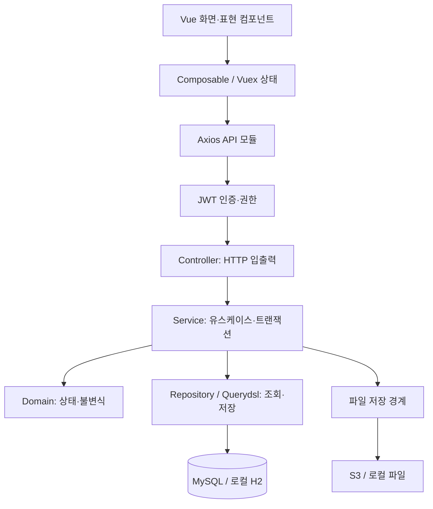
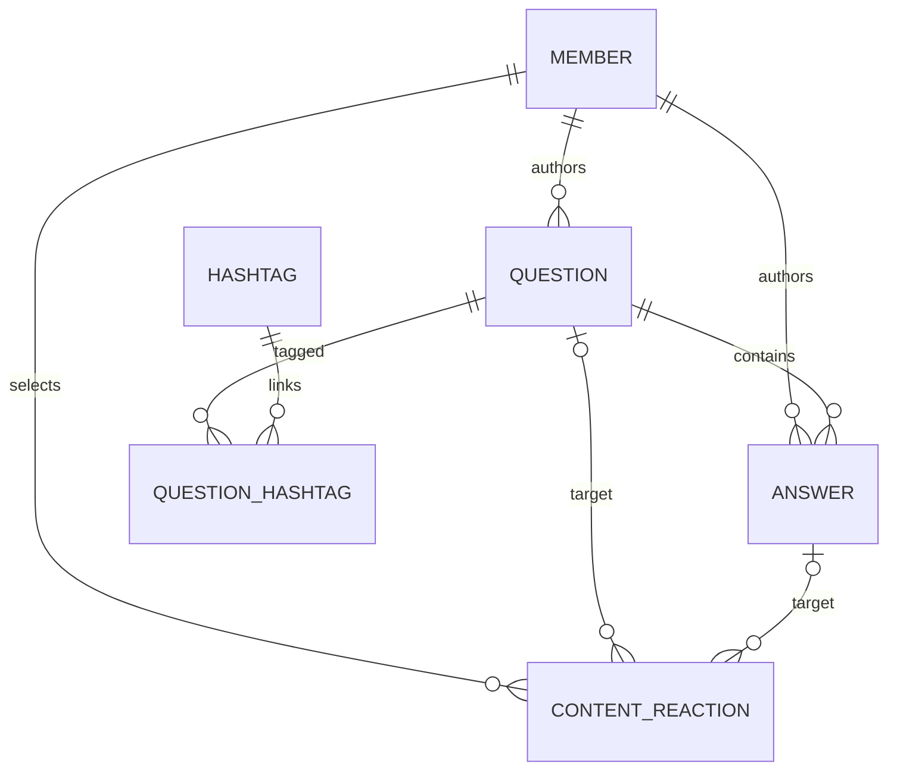

# DEMP

**개발자 채용·교육 공고를 비교하고, 학습 질문과 답변을 나누는 커뮤니티.**

운영자가 외부 공고의 핵심 조건과 출처를 확인해 게시합니다. 사용자는 채용·교육 필터로 탐색하고, **지원하기를 누르면 원본 또는 별도 지원 URL로 이동**합니다. 질문·답변에서는 Markdown 작성과 회원별 추천·비추천을 제공합니다.

[프런트엔드 저장소](https://github.com/seungmin-park/dempfrontend) · [작업 체크리스트](tasks.md) · [성능 측정 원본](docs/verification/measured-query-performance/README.md) · [운영·배포](docs/operations.md)

## 화면과 사용자 흐름


화면은 로컬 예제 데이터로 촬영했습니다.

| 영역 | 구현한 흐름 |
|---|---|
| 채용 | 신입·경력·무관 구분, 기술·직무 등 조건 탐색, 원문·지원 링크, 선택 연봉 정보 |
| 교육 | 교육 방식·지역·기간·비용·지원 대상 등 필터, 기수·지원금·마감 정보 |
| 커뮤니티 | 질문·답변 작성·조회, 태그 검색·정렬, 추천·비추천·취소와 새로고침 후 복원 |
| 관리자 | 초안→검토→공개→마감/비공개, 출처·확인일·변경 이력, 오류 제보 처리, 질문·답변 수정·삭제, 권한 검사 |
| 공통 | 무한 스크롤, 로딩·빈 목록·검색 결과 없음·요청 실패 구분, 선택 이미지와 기본 이미지 |

공고는 운영자 큐레이션 방식입니다. 기관 직접 입점·대량 자동 크롤링·원문 전체 자동 복제는 구현 범위에 포함하지 않습니다. 이미지 업로드는 선택이며 외부 URL의 이미지를 자동 수집하지 않습니다. [게시·이미지 정책](docs/plans/curated-publication-policy.md)

## 리팩터링에서 해결한 문제

### 1. 페이지 크기가 작아도 전체 공고를 읽던 조회

과거의 컬렉션 fetch join에 offset/limit를 적용하면 Hibernate가 공고 전체를 메모리에서 잘라냈습니다. 현재는 **조건에 맞는 ID를 페이지 크기+1개만 읽고, 그 ID의 상세 데이터를 가져옵니다.** 추가 1개로 다음 페이지 여부를 판단하므로 전체 count 조회도 필요하지 않습니다.


질문 목록도 전체 배열에서 20개 Slice 응답으로 바꿨습니다. 이 변화는 API 응답 계약의 개선이므로, 같은 결과를 반환하는 쿼리의 속도 개선과 구분합니다.

### 2. 회원별 반응 저장과 동시 수정

```text
인증한 회원 + 원하는 반응 상태
  → 대상 질문/답변 행 잠금
  → 이전 반응과 비교
  → 회원별 반응 + 집계 증감 함께 commit
  → 확정된 수치와 내 선택 응답
```

- `PUT`에 원하는 상태를 보내므로 같은 요청을 재전송해도 두 번 증가하지 않습니다.
- 대상 행 잠금과 회원·대상 유일 제약으로 중복 반응과 집계 경쟁을 막습니다.
- 본문 수정이 오래된 추천 수를 덮어쓰는 문제를 재현하고 `@DynamicUpdate`로 변경한 필드만 저장하도록 수정했습니다.
- 클라이언트는 저장 중 연타를 막고, 실패하면 기존 확정 값을 유지합니다. 다른 글로 이동한 뒤 도착한 응답도 폐기합니다.
- 과거 집계는 보존하지만 당시 누가 투표했는지는 추정하지 않습니다. [Red→Green 및 실제 브라우저 검증](docs/verification/persistent-content-reactions/t99-t101.md)

### 3. 필요한 연관 데이터를 조회 경계에서 함께 읽기

답변의 작성자, 질문 상세의 작성자·태그는 화면 응답을 만드는 데 필요합니다. 조회 전용 entity graph로 함께 가져오고, 수정·삭제에 사용하는 기본 조회는 확장하지 않습니다. SQL 개수 제한 테스트는 테스트 트랜잭션 없이 실제 서비스 호출을 검증합니다.

### 4. 실행 기반·보안·프런트 현대화

Java 11/Boot 2 기반의 빌드 오류부터 복원한 뒤 Java 25/Boot 4로 이전했습니다. 기존 ID 생성기·문자열 enum·JWT와 BCrypt 경계를 검증했고, Vue 제품 코드는 strict TypeScript로 전환했습니다. 서버는 본문을 정화하고 클라이언트도 출력 직전에 DOMPurify를 적용합니다. [업그레이드 호환성 기록](docs/verification/runtime-framework-and-typescript-upgrade/README.md)

## 측정으로 확인한 변화

| 측정 항목 | 최초 리팩터링 이전 | 현재 최종 | 해석 |
|---|---:|---:|---|
| 공고 첫20개 / 1만 건 p50 | 189.15ms | 3.81ms | 런타임·응답 필드도 다름 |
| 같은 요청의 로딩 엔티티 | 10,001개 | 21개 | 전체 로딩 제거 |
| 질문 목록 / 1만 건 응답 | 646,789바이트 | 1,338바이트 | 전체1만개 → 20개 Slice |
| 답변50개 SQL | 52회 | 3회 | 반응 기능 추가 후53회에서 이번에3회로 개선 |
| 답변50개 p50 / 1만 건 | 1.63ms | 3.67ms | 이 경로의 H2 지연은 증가 |


환경: Apple M2 / 16GiB, 각 테스트 JVM heap 2GiB·CPU 4개 설정, H2 메모리 DB. 공고·질문 각 1천·1만·10만 건을 생성했습니다. 완료된 조합은 독립 JVM 3개에서 각각 워밍업 5회와 표본 15회를 실행했습니다.

측정 경계는 **MockMvc를 통한 Spring MVC·인증·JPA·JSON 처리**입니다. 네트워크·브라우저 렌더링·실제 MySQL 부하를 포함하지 않습니다. 과거 버전의 10만 건 반복은 heap 부족으로 실패했으므로 p95나 속도 배수를 제시하지 않습니다. 버전별 런타임·응답 필드·질문 페이지 계약의 차이와 순차 실행 순서의 한계도 [측정 보고서](docs/verification/measured-query-performance/README.md)에 기록했습니다.

## 구조와 책임



Controller가 상태 규칙을 판단하지 않고, 서비스가 인증된 행위자·권한·트랜잭션을 조정합니다. 도메인은 생성·변경 경로를 제한하고 자신의 상태를 지킵니다. 파일 저장은 경계 뒤에 두어 테스트가 운영 S3에 접근하지 않게 합니다.

### 주요 데이터 관계



반응은 질문 또는 답변 **정확히 하나**를 대상으로 합니다. 체크 제약·유일 제약과 대상 삭제 시 cascade를 사용합니다. 전체 DB DDL 대용이 아닌 주요 관계도이며, 실제 배포 스키마 변경은 [수동 SQL](src/main/resources/db/manual)을 확인합니다.

## 기술 스택

| 영역 | 저장소에 고정한 버전 |
|---|---|
| Java / Spring Boot | Azul Zulu 25 / 4.1.1 |
| 빌드 | Gradle Wrapper 9.8.0·의존성 lockfile |
| 데이터 | Spring Data JPA·Hibernate 7·OpenFeign Querydsl 7.7, MySQL / H2 2.5.252 |
| 인증·문서 | Spring Security·JJWT 0.13, REST Docs·OpenAPI |
| 프런트 | Node 24.21.0·Vue 3.5.43·TypeScript 6.0.3·Vite 8.3.1 |

현재 재현 환경 기준이며 최신 버전 여부를 보장하는 표는 아닙니다. TypeScript는 lint 도구의 공통 지원 범위를 고려해 선택했습니다.

## 로컬 실행

필요 조건: Git, asdf와 Java/Node 플러그인. 백엔드와 프런트를 형제 디렉터리에 clone합니다.

```sh
git clone https://github.com/seungmin-park/demp.git
git clone https://github.com/seungmin-park/dempfrontend.git
cd demp
asdf install
asdf exec java -version
SPRING_PROFILES_ACTIVE=local PORT=18080 AWS_EC2_METADATA_DISABLED=true ./gradlew bootRun
```

다른 터미널에서:

```sh
cd dempfrontend
asdf install
npm ci
DEV_API_TARGET=http://127.0.0.1:18080 npm run dev
```

- 화면: `http://localhost:5050`. 로컬 계정: **local-member / password**.
- local 프로필은 `.local` 아래 H2와 로컬 파일 저장을 사용합니다. 서버를 껐다 켜도 데이터가 유지됩니다.
- 일회성 검증은 `SPRING_DATASOURCE_URL='jdbc:h2:mem:demp-demo;MODE=MySQL;DB_CLOSE_DELAY=-1'`을 추가합니다. 이 경우 서버 종료 시 데이터가 사라집니다.
- 로컬 seed 계정은 일반 회원입니다. 관리자 기능은 `ROLE_ADMIN`이 부여된 별도 계정이 필요하며 공개 회원가입으로 관리자 권한을 얻을 수 없습니다. [관리자 계정 준비](docs/verification/admin-console/account-setup.md)를 참고합니다.
- 외부 MySQL·S3 없이 local 실행이 가능합니다. `JAVA_HOME`이 다른 JDK를 가리키면 asdf Java 경로와 일치시킵니다.

## 검증

```sh
./gradlew clean test asciidoctor bootJar
python3 scripts/verify_local_flow.py  # 별도로 실행 중인 임시 local 서버 필요
```

2026-09-28 최종 검증:

| 검증 | 결과 |
|---|---|
| 백엔드 | 316개, 실패·오류·스킵0 / REST Docs·bootJar 통과 |
| 프런트 | 156개 / strict typecheck·lint·build 통과 |
| headed Playwright | 20개 통과, 현재 cmux 보조 pane에서 실행 |
| 실제 Spring/H2 | HTTP 흐름 종료0, 실제 브라우저 반응 저장·새로고침 확인 |
| 성능 비교 | 완료 그룹56개·표본2,520개, 누락·라운드 검사 통과 |

[최종 인수 기록](docs/verification/project-documentation/t104-t105.md)

테스트 계층은 Domain 순수 단위 / Repository JPA / Service 실제 commit / MVC·REST Docs WebMvcTest로 분리했습니다. 서비스 테스트에 테스트용 트랜잭션을 붙여 누락된 production 트랜잭션을 가리지 않습니다.

프런트 자동 E2E는 API fixture를 사용합니다. 실제 Spring/H2와 연결한 cmux 브라우저 검증과 범위가 다릅니다. 로컬 E2E 실행은 현재 cmux 보조 pane에서 러너 로그와 실제 브라우저 흐름을 확인했고, CI는 headless로 실행합니다. 과거 시점의 결과는 각 검증 문서에 날짜와 함께 보존합니다.

- REST Docs: `build/docs/asciidoc/index.html`
- OpenAPI: 실행 서버의 `/v3/api-docs`, `/swagger-ui.html`
- 테스트 보고서: `build/reports/tests/test/index.html`
- [반응 기능 검증](docs/verification/persistent-content-reactions/t99-t101.md)
- [게시 운영 흐름 검증](docs/verification/publication-workflow/t96-qa.md)

## 배포 전 남은 검증과 한계

운영 배포는 수행하지 않았습니다. 실제 MySQL 복제본에서 수동 스키마 변경·기존 데이터·인덱스·동시 부하를 확인해야 합니다. 이번 성능 측정은 로컬 재현 실험이며 운영 처리량이나 SLA가 아닙니다. 운영 이미지의 이용 권한·출처는 등록 시 확인해야 합니다.

운영은 `ddl-auto=validate`이며 환경변수, CORS, JWT 키 전환, 파일 저장과 롤백 절차는 [운영 가이드](docs/operations.md)에 정리했습니다. 기능별 의도적 범위·실패 기록·작업별 커밋 근거는 [tasks.md](tasks.md)와 `docs/verification/`에 남겼습니다.

## 에이전트 작업과 공식 문서

[기능 지도](docs/engineering/feature-map.md), [공식 문서·버전표](docs/engineering/official-docs.md), [반응 저장 검증 절차](.agents/skills/verify-demp/SKILL.md)를 함께 사용한다. `python3 scripts/check_agent_contracts.py`는 버전 기록과 반응 저장의 쓰기 경계를 검사한다. 이 검사는 실제 API·브라우저 테스트를 대체하지 않는다.
