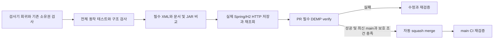
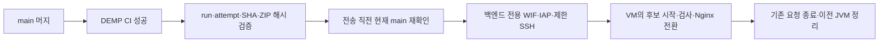

# DEMP 검증과 보호된 PR 전달

Java 25의 `JAVA_HOME`을 지정한 뒤 `bash scripts/verify.sh`를 실행한다. 로컬과 CI는 같은 명령을 사용한다. 프런트는 별도 저장소다.

## 검증 책임과 실패 조건

- 기존 Domain·Repository·Service·MVC·REST Docs 테스트는 업무 결과·예외·저장·권한·HTTP 계약을 판단한다.
- ArchUnit은 Controller의 Repository/EntityManager 직접 의존, Domain의 HTTP/DTO/Service/저장소 의존, 엔티티 public setter, Service 통합 테스트의 클래스·메서드 트랜잭션, MVC slice의 실제 저장소 의존을 거부한다.
- `ArchitectureRulesTest`는 금지·허용 bytecode 입력을 판정한다. 예제는 test-only `architecturefixture`로 앱 스캔 밖에 둔다. `ArchitectureTest`는 실제 클래스를 검사한다. 운영 경계는 test class를 제외하고, 테스트 경계는 test bytecode도 가져온다.
- 기존 `check_agent_contracts.py`는 반응 쓰기의 단일 소유권과 로컬 공식 문서 버전을 확인한다.
- `verify_ci.py`는 보고서 없음·0개·빈 suite·실패·오류·skip·필수 suite 누락, 미해결 문서·내부 테스트 키 노출, JAR 문서 불일치·구조 예제 포함을 거부한다.
- `verify_runtime.py`는 방금 만든 JAR의 기존 local API 흐름과 반응 저장·중복·전환·취소·별도 HTTP 재조회·인증 거부·문서 제공을 확인한다. 자신이 시작한 서버만 종료한다.

[필수 suite 목록](required-test-suites.json)은 업무/기반 53개와 구조 2개다. 실행 시 목록을 재생성하지 않고 실제 XML와 비교한다. 신규 suite는 허용하고 총 테스트 건수는 고정하지 않는다. 삭제·이름 변경은 대체 검증과 기능 지도를 함께 리뷰한다. suite 내부 assertion 삭제나 목록 자체의 의도적인 축소는 이 검사로 판단하지 못한다.

ArchUnit 1.5.1은 test scope다. DEMP의 concrete Service 협력은 허용하며 PlugPass의 Default/인터페이스 관례를 도입하지 않는다. 기존 외부 I/O 대체와 동시성 실험 spy도 일괄 금지하지 않는다. JaCoCo·coverage 비율은 도입하지 않는다. 불변식의 정확성·실패 후 상태는 동작 테스트가, 규칙의 적절한 소유 객체·이름·공개 계약은 리뷰가 맡는다. meta-annotation·간접 의존·reflection·source 규약 전체는 구조 검사 범위가 아니다.

문서는 build에서 생성해 JAR에 넣으며 인증된 `/docs/index.html` 응답과 비교한다. 과거 체크인 HTML을 사용하지 않는다. runtime은 loopback·임의 포트·회차별 메모리 H2·검증 전용 파일 경로를 사용한다. local seed는 이 명시적 HTTP 실험 입력이고 Java 단위/통합 테스트 fixture가 아니다. H2 재시작 보존·운영 MySQL/S3·프런트 브라우저 검증과 구분한다.

## PR와 자동 머지

사용자가 PR·머지까지 요청한 작업에서 아래 절차를 적용한다. 일반 구현·체크 요청만으로 commit 권한을 확대하지 않는다. 새 무인 봇이나 예약 작업을 만들지 않는다.

1. 의미 있는 `refactor/<목적>` 브랜치/worktree에서 변경·검증·diff·객체 책임과 호출부 리뷰를 완료한다.
2. 기존 서명 설정을 유지해 commit/push하고 같은 head의 열린 PR을 갱신하거나 main 대상 PR을 생성한다. Codex 작업에 첨부한다.
3. 실제 main 보호를 조회한다. PR 필수, GitHub Actions의 `DEMP verify` 필수, 최신 main 반영 필수, 관리자 동일 적용, 강제 push·브랜치 삭제 금지와 native auto-merge/squash 활성화를 확인한다.
4. 정확한 head SHA에 `gh pr merge <번호> --auto --squash --match-head-commit <SHA>`를 적용한다. 보호를 확인하지 못하면 PR 단계에서 제한을 보고한다. `--admin`이나 main 직접 push로 우회하지 않는다.
5. MERGED 상태와 merge SHA를 확인하고 그 SHA의 main CI까지 확인한다. 새 main과 충돌하면 통합 후 재검증한다. 신청이나 로컬 통과만으로 완료라 하지 않는다.

혼자 개발하는 저장소는 필수 승인 인원 0명을 사용하며 CI와 책임 리뷰는 별개다. CI token은 `contents: read`, checkout credential은 보관하지 않는다. merge 권한을 소스 실행 job에 넣지 않는다. PR와 main push마다 경로 필터 없이 실행하고 같은 PR의 이전 실행만 취소한다. timeout 15분, 가능한 실패 XML·HTML·snippet·HTTP 결과와 서버 로그 보관 7일이다.

로컬은 [현재 cmux 표시 규칙](../../AGENTS.md)을 따르고 연결이 없으면 실제 범위를 먼저 알린다. 원격 CI에는 로컬 화면 표시 규칙을 강제하지 않는다. [이번 계획과 실행 기록](../plans/ci-and-protected-delivery.md).

공식 근거: [ArchUnit](https://www.archunit.org/userguide/html/000_Index.html), [GitHub 보호 브랜치 API](https://docs.github.com/en/rest/branches/branch-protection#update-branch-protection), [native auto-merge](https://docs.github.com/en/repositories/configuring-branches-and-merges-in-your-repository/configuring-pull-request-merges/managing-auto-merge-for-pull-requests-in-your-repository).

## 백엔드 CD 연결과 활성화 경계

`.github/workflows/demp-backend-cd.yml`은 기본 비활성이다. `DEMP_BACKEND_CD_ENABLED=true`가 등록된 경우에만 현재 main의 성공한 **push CI**를 배포 후보로 사용한다. 수동 CD도 CI 실행 ID를 입력받아 같은 조건을 확인한다. PR CI와 수동 CI는 운영 후보로 수락하지 않는다. 이 문서와 workflow의 존재는 운영 활성화나 배포 성공의 증거가 아니다.

CD에서는 JAR를 다시 빌드하지 않는다. CI의 `deployment-demp-RUN-ATTEMPT` ZIP을 그대로 전송하며 VM도 별도로 검사한다. `production` environment는 배포 기록용이다. 실제 GitHub 보호 설정을 확인하기 전 수동 승인 절차가 있다고 가정하지 않는다. 배포는 직렬 실행하고 진행 중인 전환을 새 push로 취소하지 않는다.

백엔드 전용 변수는 `DEMP_BACKEND_WIF_PROVIDER`, `DEMP_BACKEND_CD_SERVICE_ACCOUNT`, `DEMP_BACKEND_CD_ENABLED`다. 전용 secret은 `DEMP_BACKEND_CD_SSH_PRIVATE_KEY`이며 프론트 개인 키와 구분한다. 프로젝트·zone·instance와 검증된 SSH host 공개 키는 기존 공통 변수를 사용한다. 개인 키와 환경 비밀값을 로그·문서에 기록하지 않는다.

VM 결과가 0이면 전환과 기존 요청/프로세스 정리가 완료된 것이다. 2는 `cleanup-incomplete`로 정리가 남아 있으며 자동 성공으로 표시하지 않는다. 1 또는 SSH 오류는 실패다. main 머지, CI 성공, CD 대기, VM 전환, stable은 각각 별도 상태이며 실제 VM의 status·JAR·라우트·지표를 확인해야 운영 반영을 판단할 수 있다. 코드 rollback은 DB와 업로드 데이터를 과거로 되돌리지 않는다. 구·신 schema가 호환되는 알려진 릴리스만 선택해야 한다.

전체 검증은 기존 `bash scripts/verify.sh`를 유지한다. Python workflow 검사는 Ruby 표준 YAML parser로 실제 mapping을 해석하고, 전송 metadata·오래된 main 거부·완료와 정리 미완료 구분을 확인한다. 실제 Linux의 두 JVM/MySQL/Nginx 전환은 별도 배포 저장소의 격리 검증과 운영 적용 기록으로 확인한다.
