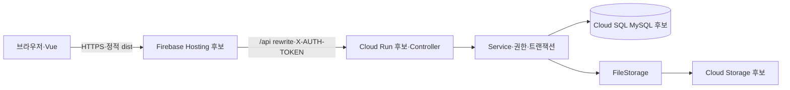

# DEMP 배포 전 릴리스 테스트 계획

작성일: 2026-10-05. 갱신일: 2026-10-06. 범위: 현재 기능의 로컬 배포 준비와 후속 Google Cloud 배포 검증.
사용자 확인: 배포 대상은 Google Cloud다. 세부 구성은 미정이며 Cloud Run(백엔드)·Cloud SQL(MySQL)·Cloud Storage(이미지)·Firebase Hosting(프런트)을 관리형 후보로 계획한다. 프로젝트·리전·배포일·실제 가용시간·기존 MySQL 유무는 아직 정해지지 않았다.
실행 모델: 개발자 1명이 환경과 결과를 책임지고 Codex가 명령·assertion·증거 정리를 보조한다. 병렬 에이전트나 별도 QA 인력을 전제하지 않는다.

로컬 실행 당시에는 클라우드 선택을 미루고 준비·검증부터 마무리하기로 했다. Phase `배포 런타임·데이터 검증`, 양쪽 브랜치 `refactor/deployment-runtime-and-data-verification`, worktree `.worktrees/deployment-runtime-and-data-verification/{backend,frontend}`에서 순차 실행했다. 시작 스크립트는 TDD로 변경했고 로컬 격리 MySQL과 실제 브라우저를 검증했다. 이후 Google Cloud로 결정했고, 사용자는 **이전 로컬 작업을 먼저 GitHub에 반영**하도록 요청했다. 이 변경에는 클라우드 전환 코드·리소스 생성·실제 배포가 없다. [실행 기록과 원시 결과](../verification/deployment-runtime-and-data-verification/README.md).

## 1. 기준 코드와 확인된 범위

| 대상 | 기준 SHA | 이미 확인한 증거 | 증명하지 않는 것 |
|---|---|---|---|
| 백엔드 | `d6a3146ffa9d7491acdcabfd5665afc710798f14` | [main CI 성공](https://github.com/seungmin-park/demp/actions/runs/37224816872), 검사기 16개와 Gradle build 성공 로그 | 실제 MySQL 이관, S3 권한, 클라우드 기동 |
| 프런트 | `7f63e0640216ba5486d9af79c454d56e47565682` | [main CI 성공](https://github.com/seungmin-park/dempfrontend/actions/runs/37231070708), 단위 assertion 204개·Chromium Playwright 160개 통과 | 실제 Spring/MySQL/S3 결합, 운영 reverse proxy |

위 숫자는 해당 CI 실행의 관찰값이며 고정 목표가 아니다. 후보 코드가 바뀌면 새 SHA와 산출물로 재검증한다. [기존 계획](../../tasks.md)의 Phase 0~16은 완료 기록이 있으므로 이미 구현한 기능을 다시 새 작업으로 계산하지 않는다. 프런트 E2E는 API fixture를 사용하며 development/production 두 프로젝트를 실행한다.

## 2. 요구사항과 기존 테스트 연결

R1~R6는 직전 배포 잔여 작업 6개를 이 문서에서 추적하기 위한 ID다. 별도 이슈 보드의 티켓 번호는 아니다. 기존 검증을 재사용하고 실제 환경에서 비어 있는 경계를 추가한다.

| ID | 배포 요구사항·변경 성격 | 기존 자동 검증 | 추가 시나리오 | 상태와 GAP 처리 |
|---|---|---|---|---|
| R1 | 런타임·시작 명령: Java 25/Gradle 9.8, Cloud Run 컨테이너 후보와 PORT, 프런트 build 시 Node 24 | [공용 backend verify](../../scripts/verify.sh), [JWT 설정](../../src/test/java/com/inhatc/demp/config/jwt/JwtTokenProviderConfigurationTest.java) `rejectsShortKeyWithConfigurationMessage`·`acceptsKeyAtByteBoundary`, [frontend verify](https://github.com/seungmin-park/dempfrontend/blob/7f63e0640216ba5486d9af79c454d56e47565682/scripts/verify.mjs) | T01~T03, T25 | 실제 컨테이너/클라우드 기동 미검증. 구성 확정 후 필수 실행 |
| R2 | MySQL 스키마·기존 데이터·ID 생성·백업 복원: 수동 SQL과 Hibernate 버전 변경 | [기존 스키마](../../src/test/java/com/inhatc/demp/config/LegacySchemaCompatibilityTest.java) `readsAndWritesLegacySchema`, [재시작](../../src/test/java/com/inhatc/demp/config/DatabaseLifecycleTest.java) `preservesMemberAcrossRestart`, [반응 동시성](../../src/test/java/com/inhatc/demp/service/ContentReactionServiceTest.java) `concurrentReactions` | T04~T08 | H2만으로 MySQL 완료 처리하지 않음. 대상 스키마/복제본 준비 후 필수 실행 |
| R3 | 비밀 설정·실제 이미지 저장: Cloud Storage 후보의 FileStorage 구현·서비스 계정·공개 읽기 정책 | [파일 입력](../../src/test/java/com/inhatc/demp/service/FileServiceTest.java), [업로드 보상](../../src/test/java/com/inhatc/demp/service/AnnouncementUploadCompensationTest.java), [본문 이미지](../../src/test/java/com/inhatc/demp/service/AnnouncementBodyImagesTest.java), [삭제 실패](../../src/test/java/com/inhatc/demp/service/admin/AdminOperationsTest.java) `deleteReportsCleanupFailure` | T03, T09~T13, T19 | 현재 구현은 S3. 저장소 전환 후 실제 IAM/URL을 필수 실행 |
| R4 | HTTPS·정적 파일·API·인증 헤더: 실제 ingress 환경 추가 | [CORS](../../src/test/java/com/inhatc/demp/config/CorsPolicyTest.java), [정적 서버 API 404](https://github.com/seungmin-park/dempfrontend/blob/7f63e0640216ba5486d9af79c454d56e47565682/tests/unit/server.spec.js), [401 상태 처리](https://github.com/seungmin-park/dempfrontend/blob/7f63e0640216ba5486d9af79c454d56e47565682/tests/unit/apiClient.spec.js), [응답 경합](https://github.com/seungmin-park/dempfrontend/blob/7f63e0640216ba5486d9af79c454d56e47565682/tests/unit/ContentReactionControl.spec.js) | T14~T16, T24 | 개발/preview proxy를 운영 연결 증거로 대체하지 않음. 실제 도메인에서 필수 실행 |
| R5 | 운영 관리자·공고: 검증된 기능에 실제 계정·콘텐츠 준비 | [권한](../../src/test/java/com/inhatc/demp/config/ApiSecurityTest.java) `adminAccessRequiresStoredRole`·`adminRevocationTakesEffectImmediately`, [게시](../../src/test/java/com/inhatc/demp/service/PublicationWorkflowTest.java), [동일 출처 경쟁](../../src/test/java/com/inhatc/demp/service/PublicationDuplicateConcurrencyTest.java), [이미지 수정 경쟁](../../src/test/java/com/inhatc/demp/service/admin/AdminAnnouncementConcurrencyTest.java), [관리자 화면](https://github.com/seungmin-park/dempfrontend/blob/7f63e0640216ba5486d9af79c454d56e47565682/tests/e2e/admin.spec.js) | T17~T19 | 실제 역할 부여·게시 데이터 미확인. 비운영 데이터로 인수 후 운영 준비 상태 확인 |
| R6 | 실제 사용자 경로·배포 순서·복구: 처음 확인할 운영 결합 경계 | [회원](../../src/test/java/com/inhatc/demp/service/MemberServiceTest.java), [질문](../../src/test/java/com/inhatc/demp/service/QuestionServiceTest.java), [답변](../../src/test/java/com/inhatc/demp/service/AnswerServiceTest.java), [반응 저장](../../src/test/java/com/inhatc/demp/config/ApiSecurityTest.java) `persistsReactions`, [화면 흐름](https://github.com/seungmin-park/dempfrontend/blob/7f63e0640216ba5486d9af79c454d56e47565682/tests/e2e/community.spec.js), [반응형](https://github.com/seungmin-park/dempfrontend/blob/7f63e0640216ba5486d9af79c454d56e47565682/tests/e2e/responsive-layout.spec.js) | T20~T27 | 실제 MySQL·저장소 결합/배포 복구 미검증. T20~T26은 비운영 환경, T27은 실제 배포 후 실행 |

매핑 6/6. 전체 범위 완료는 T01 **1/27**이며, T02~T08/T15/T17/T20~T22/T24/T26에는 아래 7.1의 로컬 실행 증거가 있다. 실제 클라우드/운영 복제본/이전 산출물 범위를 완료로 올리지 않는다. 기존 자동 테스트와 MySQL 리허설·보이는 브라우저 절차를 재사용하며, 아래 실제 환경 사례 26개 전체를 자동화했다고 계산하지 않는다. 설명 없는 GAP는 없지만 환경 실행 공백은 남아 있다.

## 3. 책임과 실패가 발생하는 경계



Vue/composable은 로딩·확정값·늦은 응답 폐기를, Controller는 HTTP 변환을, Service는 권한과 트랜잭션을 소유한다. DB는 저장·제약·잠금을, FileStorage는 외부 파일 I/O를 담당한다. DB rollback은 객체 저장소 파일을 되돌리지 않으므로 업로드 보상과 `cleanupPending`은 별도 결과로 확인한다. 클라우드 선택 때문에 게시·반응 규칙의 책임을 옮기지는 않는다.

사전 정적 발견:

- [run.sh](../../run.sh)는 후보 JAR를 실행하는 시작 명령이다. [시작 계약 테스트](../../scripts/test_launch.py)의 실제 실패 후 기본 포트·후보 경로·인자·입력 거절·`exec`를 구현했고, 현재 JAR/MySQL의 기동·재시작까지 이 명령으로 확인했다. 실제 클라우드 기동은 T02 환경대기다.
- 운영 [application.yml](../../src/main/resources/application.yml)은 `ddl-auto=validate`, seed `never`다. 기존 DB에는 [본문 이미지](../../src/main/resources/db/manual/announcement-body-images.sql), [연봉](../../src/main/resources/db/manual/announcement-compensation.sql), [교육](../../src/main/resources/db/manual/announcement-education.sql), [게시](../../src/main/resources/db/manual/announcement-publication.sql), [반응](../../src/main/resources/db/manual/content-reaction.sql)의 적용 여부를 대조한다. 새 DB이면 이 ALTER SQL만으로 전체 스키마를 만들 수 없으므로 초기 스키마 준비도 필요하다. SQL은 적용 이력 확인 후 필요한 것만 실행한다.
- [AwsS3Config](../../src/main/java/com/inhatc/demp/config/aws/AwsS3Config.java)는 AWS 정적 credential provider를 사용하고 [FileService](../../src/main/java/com/inhatc/demp/service/FileService.java)는 `PUBLIC_READ` ACL을 보낸다. Cloud Storage 후보는 기존 [FileStorage](../../src/main/java/com/inhatc/demp/service/FileStorage.java) 경계에 별도 구현과 설정 선택을 마련해야 한다. 런타임 서비스 계정의 ADC를 사용하도록 전환할 때 필수 S3 설정이나 중복 FileStorage bean이 기동을 막지 않는지도 검증한다. [Cloud Run 서비스 계정과 ADC](https://docs.cloud.google.com/run/docs/securing/service-identity).
- Cloud Storage의 uniform bucket-level access에서는 객체 ACL 요청이 거절된다. 업로드 권한과 브라우저의 이미지 읽기는 서로 다른 계약이다. 공개 읽기/CDN/서명 URL 중 방식을 확정하고 T09/T13에서 응답 URL·기존 key·기본 이미지까지 검증한다. Public Access Prevention이 적용된 버킷은 공개 공유할 수 없다. [uniform 접근 제어](https://docs.cloud.google.com/storage/docs/uniform-bucket-level-access), [공개 읽기](https://docs.cloud.google.com/storage/docs/access-control/making-data-public).
- Cloud Run 컨테이너, Cloud SQL Java 연결, Firebase Hosting의 API rewrite는 후속 준비 항목이다. 컨테이너는 `0.0.0.0:$PORT` 수신을, DB 연결은 서비스 계정 권한과 연결 풀을, 프런트는 `/api` 전달과 SPA 새로고침을 검증해야 한다. 현재 프런트 production Node 서버의 `/api` 404와 로컬 preview proxy 통과를 운영 라우팅 증거로 혼동하지 않는다. [Cloud Run 계약](https://docs.cloud.google.com/run/docs/container-contract), [Cloud SQL 연결](https://docs.cloud.google.com/sql/docs/mysql/connect-run), [Hosting과 Cloud Run](https://firebase.google.com/docs/hosting/cloud-run).

위 클라우드 위험은 코드·공식 문서 대조 결과이며 실제 클라우드 재현 증거는 없다. Google Cloud·Firebase 공식 문서는 2026-10-06 확인했다. Firecrawl CLI는 현재 Node preset에서 실행되지 않아 공식 사이트를 웹 검색 도구로 확인했다. 세부 구성과 전환 구현 계획은 이전 로컬 작업의 GitHub 반영 후 구체화한다.

## 4. 시나리오와 통과 조건

단계 L=로컬 기존 러너, M=격리된 실제 MySQL/복제본, C=선택한 클라우드의 비운영 결합 환경, P=실제 배포 후 확인. C의 장애 주입·데이터 삭제·역할 회수·경쟁 요청은 운영에 적용하지 않는다.
분류: 정상, 유효성, 오류, 경계값, 동시성, 통합. 위험 H=데이터 손실·권한 우회·주요 기능 불가, M=일부 탐색/화면 장애. 아래는 전체 통과 조건이며 **현재 실행 상태는 7.1**에 기록한다.
예상 시간은 준비된 환경에서 절차 보완·실행·증거 정리 시간을 합친 값이다. 구현 수정과 새 자동 러너 작성은 포함하지 않는다.

| ID / 요구사항 | 단계·분류 | 위험 / 시간(h) | 입력·행동 → 통과 조건 | 남길 증거 |
|---|---|---|---|---|
| T01 / R1 | L·통합 | H / 0.50 | 아래 양쪽 공용 verify 실행 → 종료 0, 필수 suite/flow 존재, 실패·오류·skip 0, 예상하지 않은 Vue warning 0, 문서/JAR 일치 | 명령·SHA·종료 코드·XML·JSON·headed 러너 로그 |
| T02 / R1 | C·정상·오류·통합 | H / 1.00 | 새 JAR/dist와 실제 시작 명령 사용→인증/API 제공; 소유한 서버 종료·재시작→같은 산출물 기동, 데이터 보존, local seed 없음 | 런타임 버전·산출물 hash·프로세스 경로·기동/재시작 로그 |
| T03 / R1,R3 | L/C·유효성·경계값 | H / 0.25 | 격리 설정의 JWT 누락·31 UTF-8바이트→기동 거부, 비밀값 미출력; 32바이트→발급/검증 성공; 운영 키는 값 공개 없이 조건만 확인 | 기존 JWT assertion·마스킹한 설정 결과 |
| T04 / R2 | M·정상·유효성·통합 | H / 1.00 | 기존 DDL/SQL 적용 이력 대조→필요한 5종 SQL만 적용 후 validate 성공; 버리는 별도 복제본에서 필수 컬럼 누락→기동 거부, 자동 생성 없음 | 적용 전후 DDL·SQL 파일 hash·적용 이력·기동 로그 |
| T05 / R2 | M·정상·경계값 | H / 0.75 | 기존 회원·질문·답변·공고 표본 읽기와 신규 저장→ID 충돌 없음, 한글/태그/enum/날짜 보존, NULL 금액을 0원으로 바꾸지 않음 | 표본 ID·변경 전후 값·별도 연결 재조회 |
| T06 / R2 | M·오류·통합 | H / 0.50 | 신규 질문·답변·반응 저장 후 앱 재시작→동일 데이터·회원별 선택, 기존 행 건수 보존, seed 추가 없음 | 재시작 전후 HTTP/SQL assertion·서버 로그 |
| T07 / R2 | M·유효성·동시성 | H / 1.00 | 같은 회원/대상 반응 중복 및 두 회원 요청→유일 행·정확한 delta, 교차 대상/없는 FK 거절; 잠금 대기 오류가 있으면 실패 응답과 저장 상태 함께 기록 | 동시 요청 결과·제약 이름·SQLState·반응 행/집계 대조 |
| T08 / R2 | M·오류·통합 | H / 1.00 | 백업을 새 격리 MySQL에 복원→스키마·표본·건수 일치, 호환 JAR 기동·읽기/쓰기 성공; 복구 절차의 실제 소요시간 기록 | 백업/복원 명령·종료 코드·복원 비교·호환 버전 |
| T09 / R3 | C·정상·통합 | H / 0.75 | PNG/JPEG 대표·본문 이미지 업로드→재조회 URL에서 실제 bytes/Content-Type 확인; 교체·삭제→DB 참조와 파일 수명주기 일치 | 생성 key·GET 응답·DB 재조회·삭제 후 저장소 조회 |
| T10 / R3 | L/C·유효성·경계값 | M / 0.50 | 정상 이미지 및 5MiB 이하 입력 허용, 5MiB 초과~10MiB 미만 파일·확장자/MIME/시그니처 불일치→400, 공고/파일 신규 저장 없음 | 입력 크기/유형·응답·DB/저장소 전후 대조 |
| T11 / R3 | C·오류 | H / 0.75 | 비운영 저장소의 쓰기 권한 거부 또는 통신 실패→성공으로 표시하지 않음, DB 공고 미생성, 비밀·stacktrace 미노출, 복구 후 재시도 성공 | 주입 조건·HTTP/화면 오류·로그·잔여 key |
| T12 / R3 | L/C·오류·동시성·통합 | H / 1.00 | 부분 업로드/DB commit 실패→새 파일 보상; DB 삭제 성공+파일 삭제 거부→`cleanupPending=true`, 삭제 상태 재조회 일치; 기존 테스트로 commit 실패/이미지 경쟁 회귀 확인, 실제 저장소에서는 격리 실패 주입과 잔여 파일 정리까지 확인 | 기존 보상 assertion·HTTP 결과·DB/파일 잔여물·정리 기록 |
| T13 / R3 | C·유효성·통합 | H / 0.75 | Cloud Storage 후보 확정·구현 후→런타임 ADC/IAM으로 업로드·GET·삭제 성공, 객체 ACL 요청 없음, 브라우저 URL 읽기와 기존 key/기본 이미지 유지; 비운영 쓰기·삭제 권한 거부→실패 상태·잔여물 일치, S3로 오발송 없음 | provider·설정 이름·버킷/권한 정책·요청 결과·오류 코드 |
| T14 / R4 | C·정상·통합 | H / 0.50 | HTTPS 도메인에서 목록/깊은 SPA 경로 새로고침→정상 화면; `/api`→JSON과 Spring 응답, 정적 HTML 아님; 인증서/이미지 mixed content 오류 없음 | URL·상태/Content-Type·브라우저 네트워크·스크린샷 |
| T15 / R4 | C·유효성·통합 | H / 0.50 | 실제 `X-AUTH-TOKEN` 전달→인증 성공; 외부 origin 방식이면 허용 preflight 성공·미허용403; same-origin이면 브라우저 preflight 비적용을 기록하고 서버 CORS 단위 계약 유지 | origin·인증 여부·preflight/응답 헤더·라우팅 구성 |
| T16 / R4 | L/C·오류·동시성 | H / 0.75 | 인증 만료401→인증 삭제·로그인 redirect; 비운영 API 중단→오류/재시도, 기존 목록/확정 반응 보존; 지연 응답 뒤 검색/대상 변경→새 상태를 덮지 않음 | fixture 회귀·실제 장애 조건·DOM/HTTP assertion·복구 결과 |
| T17 / R5 | C·유효성·오류·통합 | H / 0.50 | 무인증/일반 회원의 `/api/admin/me`→401/403, 확인한 admin→200; 공개 가입의 role 위조 거절, admin 역할 회수 후 같은 토큰→403 | 세 역할별 응답·역할 변경 기록·브라우저 차단 |
| T18 / R5 | C·정상·유효성·경계값 | H / 0.75 | EMP/EDU 각각 초안→검토→공개→비공개, 모집 종료와 게시 상태 분리; 출처/확인일/이력 저장, 잘못된 URL·역전 연봉/교육 기간→400; 이미지 없는 공고·NULL 금액 유지 | 관리자/일반 조회·검색·원문 이동·별도 재조회 |
| T19 / R3,R5 | M/C·동시성 | H / 0.75 | 같은 출처/기관/기수 동시 등록→하나 저장·다른409; 공고 이미지 교체와 수정/삭제 경쟁→삭제 key 참조 부활 없음 | 요청별 응답·최종 DB/파일 상태·경쟁 테스트 로그 |
| T20 / R6 | C·정상·유효성·경계값 | H / 1.00 | 가입→form 로그인→새로고침→로그인 유지; 중복/빈 username 거절, 한글 비밀번호72 UTF-8바이트 허용·초과400; 기존 BCrypt 로그인 유지 | HTTP·저장값 검증 결과·DOM; 비밀번호/토큰 원문 제외 |
| T21 / R6 | C·정상·유효성·오류 | H / 1.00 | 질문/태그/답변 작성→수정→별도 조회→타인 수정 거절→삭제; HTML 실행 요소가 실행되지 않음, 없는 대상404, 빈 필수 입력400 | 두 회원별 응답·태그/본문 재조회·XSS 비실행 assertion |
| T22 / R6 | M/C·정상·동시성·통합 | H / 1.00 | 질문/답변 추천→같은 PUT 재전송→전환→취소→reload·새 연결 조회; 두 회원 동시 요청 및 본문 수정 경쟁→새 행/집계 delta 일치, 다른 회원 선택 독립 | 응답·aria-pressed·회원별 행·집계 비교·동시 요청 로그 |
| T23 / R6 | C·정상·경계값 | M / 0.75 | EMP/EDU 필터·정렬·빈 결과 초기화·상세 원문 이동; 21개 공개 fixture에서 페이지 중복/누락 없이 마지막 종료; 모바일 필터 reload/뒤로가기 복원 | 내용 ID·hasNext·요청 페이지·필터 URL·DOM assertion |
| T24 / R4,R6 | L/C·경계값 | M / 0.50 | 기존 320/390/640/768/1024/1440px 회귀+실제 도메인 390/1440px→가로 넘침/버튼 잘림 없음, 핵심 로그인·필터·반응 버튼을 키보드로 조작 가능 | headed 결과·화면 크기·스크린샷·키보드 관찰 |
| T25 / R1,R6 | C·오류·동시성·통합 | H / 0.75 | DB 적용→백엔드→API 확인→프런트 교체 순서 리허설, 이전 프런트 호환 여부 확인; 실패 시 프런트→호환 백엔드 복구, 혼합 버전 노출/DB 복구 필요성을 기록 | 배포 SHA/hash·이전/새 응답 비교·복구 실행 결과 |
| T26 / R6 | C·오류·통합 | H / 0.50 | 재시작/401/403/5xx를 발생시켜 실제 로그 조회→상태와 원인 확인 가능, JWT/비밀번호/스토리지 비밀 미노출; 선택한 모니터링의 오류 감지 경로 확인 | 마스킹 로그·조회 명령·감지/복구 시각 |
| T27 / R6 | P·정상·통합 | H / 0.50 | 실제 배포 후 HTTPS·로그인·공개 목록·상세/이미지·관리자 접근·지정 QA 콘텐츠의 반응 재조회→일치; 별도 QA ID만 사용, 일반 사용자 콘텐츠 미변경 | 실제 배포 SHA·URL·시각·assertion·오류 로그 확인 |

T13은 저장소 한 곳의 최초 예산이며 Google Cloud 구현·환경 준비 후 재산정한다. 추가 클라우드에 배포한다면 C/P 단계와 T13을 환경별로 반복하고 증거를 분리하며 추가 시간을 산정한다. 초기 반응 집계가 남은 기존 데이터는 총 count=신규 반응 행 수라고 가정하지 않는다. T07/T22는 초기값을 기록해 이번 요청의 delta와 테스트 회원의 행을 검증한다.

분해 교차 점검: 정상=T02/T05/T09/T18/T20~T23/T27, 유효성=T03/T04/T07/T10/T13/T15/T17/T18/T20/T21, 오류=T02/T06/T08/T11/T12/T16/T17/T21/T25/T26, 경계값=T03/T05/T10/T18/T20/T23/T24, 동시성=T07/T12/T16/T19/T22/T25, 통합=T01/T02/T04/T06/T08/T09/T12~T15/T17/T22/T25~T27. 런타임/도메인 설정 자체의 경쟁은 T25의 배포 버전 혼합으로 확인하며 DB·이미지·UI 경쟁과 구분한다.

## 5. 우선순위·예산·진행 순서

각 시나리오 위험과 비용은 위 표에 있다. 비용 L은 1시간 미만, M은 1~4시간, H는 4시간 초과다. 시간이 줄면 아래 낮은 위험 항목을 먼저 조정하며 높은 위험 검증과 여유 시간을 삭제해 일정을 맞추지 않는다.

| 위험 × 비용 | 해당 시나리오 | 실행 우선순위 |
|---|---|---|
| H × L | T01,T03,T05,T06,T09,T11,T13~T18,T19,T25~T27 | 실행 가능한 선행 조건부터 우선 수행 |
| H × M | T02,T04,T07,T08,T12,T20~T22 | 환경 준비 직후 예약, 필수 완료 |
| M × L | T10,T23,T24 | 높은 위험의 빠른 검사 다음에 실행; 부족하면 축소 범위를 명시 |
| M × M/H, L × 전체 | 이번 범위에 없음 | 임의의 낮은 위험 항목을 추가하지 않음 |

시간보다 의존성이 우선이다. T27은 비용이 낮아도 배포 전에 실행할 수 없으며, T09는 T13의 호환 설정이 준비되어야 성공을 판정할 수 있다.

| 작업 유형 | 제안 예산(h) | 책임·범위 |
|---|---:|---|
| 환경 확인·최소 fixture 준비 | 2.00 | 개발자: 대상/접속/권한 확정. Codex: 소스·설정 이름·fixture 검토 |
| 기존 전체 자동 러너 실행·증거 확인(T01) | 0.50 | Codex 보조, cmux에서 표시 |
| 실제 서버·DB·스토리지·HTTP·화면 절차(T02~T27) | 19.00 | 개발자와 Codex, 환경을 바꿔 순차 실행 |
| 테스트/증거 리뷰 | 0.50 | 동일인의 자기 검토 한계를 기록하고 명령/원시 결과로 재현성 확보 |
| 결함 조사 여유 | 4.00 | 원인·기존 실패 구분, 시간 소모 기록 |
| 수정 후 재검증 여유 | 3.00 | 결함 대상 회귀와 영향을 받은 전체 검사 |
| 환경/미예상 입력 조사 여유 | 1.00 | 접속·fixture·설정 문제 확인 |
| **합계** | **30.00** | **계획 작업 22h(73.3%), 여유 8h(26.7%)** |

이는 최초 제안 예산이며 합의된 마감/가용시간이 아니다. Google Cloud 구성 확정 시 재산정한다. 컨테이너·Cloud SQL 연결·Cloud Storage 구현, 서비스/DB/버킷 생성, 백업 전송 대기, 스키마/시작 스크립트 수정, 새 자동화 작성 시간은 별도다. 실제 가용시간이 정해지면 차이를 기록한다. 기존 CI 실행시간을 실제 클라우드 검증시간으로 환산하지 않는다.

| 순서 | 선행 조건 | 작업 묶음·시간 | 다음 단계로 넘길 결과 |
|---|---|---|---|
| A | 로컬 도구/소스 확인 | fixture·환경 확인 2h + T01/T03 0.75h | 후보 SHA·JAR/dist·러너 로그, JWT 설정 조건 |
| B | 실제 MySQL 또는 기존 DB 복제본 | T04~T08 4.25h | 스키마/ID/재시작/제약/복구 증거 |
| C | B 통과와 선택한 클라우드의 비운영 서버·도메인·저장소 | T02 + T09~T19 8.50h; T13 호환 설정을 먼저 확인 | 실제 기동·파일·proxy·인증·관리자·게시 경계 결과 |
| D | B/C의 필수 결과 통과 | T20~T24 4.25h | 실제 결합 사용자 흐름·경쟁·모바일 결과 |
| E | 리허설 가능한 호환 이전 산출물; 이후 실제 배포 | T25~T27 1.75h + 증거 리뷰 0.50h | 복구 리허설·로그·배포 후 확인 |

여유 8h는 작업 중 결함 발견 즉시 사용하며 마지막에 몰아 쓰지 않는다. 마지막 배포 전 확인에서는 새 요구사항을 추가하지 않고 기존 결과와 후보 버전을 대조한다. 실제 배포 날짜까지의 대기는 검증 작업시간에 포함하지 않는다.

명시적 보류: 두 번째 클라우드 전체 반복, Firefox/Safari 전체 회귀, 정량 동시 사용자 부하/SLO 판정, 자동 크롤링·기관 직접 제출·유료 상품. 첫 배포 환경 1곳과 현재 Chromium 범위를 먼저 검증한다. 추가 브라우저 사용자가 요구되면 매트릭스를 확대한다. 부하 목표가 없으므로 과거 H2 성능 측정을 MySQL SLA 통과로 쓰지 않으며, 정량 부하는 목표 트래픽/허용 지연 확정 후 별도 계획으로 산정한다. 보류는 해당 범위의 통과를 뜻하지 않는다.

## 6. 환경·데이터·실행 방법

환경은 L(현재 cmux의 격리 Spring/H2+headed fixture E2E), M(실제 MySQL의 비운영 DB/복제본), C(Google Cloud 비운영 환경), P(배포 이후)로 분리한다. 프로젝트·리전·클라우드 URL·MySQL 버전/기존 스키마·백업 저장 위치·공개 이미지 정책·서비스 계정/비밀 제공 방식은 현재 미정이다. 값이 확인되기 전 M/C/P 결과를 완료로 바꾸지 않는다. 클라우드를 선택해도 local 프로필을 운영에서 사용하지 않는다.

테스트 데이터는 회차 ID로 구분한다. 일반 회원 U/V 2명과 관리자 A 1명, 태그 있는 질문 Q와 답변 1개, EMP/EDU 각 초안/공개/마감/비공개 최소 fixture를 준비한다. T23에만 21개 공개 공고를 별도로 추가한다. PNG/JPEG·MIME 위장·크기 경계 파일, 출처 중복 2건, NULL 금액과 한글 입력을 각 해당 사례에서 만든다. 실제 자격증명은 비밀 관리 경계에 보관하고 이 문서/로그에 적지 않는다. 기존 DB 복제본은 별도 보관하고 원본 콘텐츠에 테스트 표식을 추가하지 않는다.

일반 회원은 form 로그인과 `X-AUTH-TOKEN` 계약을 사용한다. [운영 환경변수](../operations.md#운영-환경변수와-프로필), [API 연결](https://github.com/seungmin-park/dempfrontend/blob/7f63e0640216ba5486d9af79c454d56e47565682/docs/operations.md#api-연결과-인증-phase-4-t41), [관리자 역할 준비](../verification/admin-console/account-setup.md)를 따른다. 관리자 준비 SQL의 실제 컬럼명을 확인한다. 회원별 선택·공개/비공개·파일 참조는 HTTP 성공만 보지 않고 새 연결의 재조회로 검증한다.

기존 전체 검증 명령은 실행할 백엔드/프런트 저장소에서 각각 사용한다. Java 설치 경로는 `.tool-versions`의 Zulu 25인지 확인하고 `JAVA_HOME`을 지정한다.

```sh
# 백엔드: Java 25의 JAVA_HOME을 확인한 뒤
bash scripts/verify.sh
# 프런트: package.json의 Node 24 환경에서
npm run verify -- --headed
```

필요한 결함 반복에만 기존 대상을 좁힌다. 예: `./gradlew test --tests '*LegacySchemaCompatibilityTest' --tests '*ContentReactionServiceTest' --console=plain`. 전체 통과 후 코드가 바뀌지 않았고 새로운 우려도 없다면 같은 전체 검사를 반복하지 않는다. 버그/동작 수정은 실패 assertion을 먼저 실행하는 [TDD 규칙](../../AGENTS.md)을 따른다.

`scripts/verify_local_flow.py`와 `verify_runtime.py`는 loopback/H2 전용이다. 클라우드 URL로 바꾸거나 guard를 약화해 운영 smoke로 사용하지 않는다. T02~T27의 실제 환경 절차는 이 문서의 charter를 사용해 별도 HTTP/SQL/브라우저 결과를 기록한다. 새 자동 러너가 필요하면 현재 verify 체계를 확장할지 먼저 검토한다.

로컬 E2E 실행 전 `CMUX_WORKSPACE_ID`, `CMUX_SURFACE_ID`, `cmux identify --json`으로 호출 workspace/surface를 확인한다. 기존 보조 pane을 재사용하고 없을 때만 호출 터미널 오른쪽에 하나를 만든다. 생성 시 지원되는 `--focus false`, send에는 확인한 `--workspace`/`--surface`를 쓴다. 저장소/worktree와 흐름을 먼저 설명하고 러너/서버 명령·로그는 보조 터미널에 표시한다. 같은 workspace 브라우저에서 실제 클릭·입력·이동·reload를 보여준다. 사용자 입력 중인 터미널에 명령을 보내지 않는다.

Playwright는 headed로 실행하되 fixture 자동 러너와 실제 Spring/MySQL/S3 브라우저 절차를 따로 기록한다. cmux 브라우저에서 fixture를 재현하지 못해도 기존 assertion을 줄이지 않는다. cmux가 없거나 소켓이 막히면 실제 실행 가능 범위를 보고하고 화면 검증은 미실행으로 남긴다. pane을 유지하며 소유한 프로세스만 정리한다. 실행 상세는 기존 [backend verify 스킬](../../.agents/skills/verify-demp/SKILL.md)과 [frontend verify 스킬](https://github.com/seungmin-park/dempfrontend/blob/7f63e0640216ba5486d9af79c454d56e47565682/.agents/skills/verify-dempfrontend/SKILL.md)을 재사용한다.

## 7. 진입·종료 기준과 기록

진입 조건과 현재 상태:

- [x] 현재 요구사항 6개와 기준 SHA의 양쪽 원격 CI 성공을 확인했다.
- [x] 로컬 후보 HEAD+미커밋 시작 스크립트·JAR/dist hash·런타임·시작 명령을 기록했다. 실제 릴리스 후보 확정 시 기준을 다시 갱신한다.
- [x] 격리 MySQL 8.4.11과 번역한 legacy fixture·loopback/소유 컨테이너 경계로 로컬 M 리허설을 실행했다.
- [ ] 실제 운영 복제본과 Google Cloud C의 프로젝트/리전/도메인/접속 경계를 준비한다. 관리형 세부 구성은 후보 상태다.
- [ ] T13의 Cloud Storage 구현·ADC/IAM·공개 이미지 정책 공백을 해소하고 해당 선택을 기록한다. 현재 실제 환경 미검증.
- [x] 로컬 현재 버전의 MySQL dump/별도 스키마 복원·재기동·신규 저장을 검증했다.
- [ ] 실제 백업·호환 이전 산출물·복구 경로를 준비한다. 이전 버전 호환은 아직 검증하지 않았다.

배포 전 검증 종료 조건(현재 모두 미달성):

- [ ] T01~T26 완료, 실패/skip/미실행과 허용되지 않은 Vue warning 없음. 범위 조정 사례는 이유·영향·사용자 결정을 기록한다.
- [ ] 높은 위험 시나리오의 저장/권한/파일/복구 결과에 원시 증거가 있고 미해결 데이터 손실·권한 우회·주요 경로 차단 결함이 없다.
- [ ] MySQL DDL·SQL 적용 이력·재시작 보존·백업 복원과 실제 저장소의 업로드/삭제/실패 처리 확인.
- [ ] 요구사항 매핑 6/6, 모든 실행 GAP의 해소 또는 명시적 범위 결정; 후보와 소스/빌드/검증 버전 일치.
- [ ] 배포 순서·복구 리허설 결과·운영 관리자 준비 상태·오류 로그 조회 경로 확인.

배포 후 확인 종료 조건: T27의 실제 대상 SHA·URL·HTTP/DOM assertion·오류 로그를 기록한다. 이 테스트 계획은 배포 승인/실행 자체를 수행하지 않는다.

기존 증거 위치는 백엔드 `build/test-results/test/`, `build/reports/tests/test/`, `build/verification/{runtime.json,server.log,local-flow.log}`와 프런트 `.verification/{summary.json,unit.json,e2e.json}`, 단계 로그, `test-results/`, `playwright-report/`다. 이번 로컬 원시는 `/private/tmp/demp-release-20261005/`, 보존할 결과·마스킹한 클릭 기록·스크린샷은 [실행 증거](../verification/deployment-runtime-and-data-verification/evidence/execution-summary.json)에 있다. 향후 클라우드 회차는 `build/verification/release/<회차ID>/` 아래에 환경/SHA와 함께 기록한다. 실제 비밀값·개인정보는 제외한다.

실행 중 아래 한 줄 형식으로 사례별 기록을 추가한다: `T-ID | 환경·provider | SHA/산출물 hash | 정확한 명령 또는 클릭·입력 | 기대/실제 assertion | 종료코드 | 상태 | 로그/보고서 위치 | 실제 시간`. 상태는 계획/진행/통과/실패/환경대기/명시적보류를 사용하며 환경대기를 통과로 바꾸지 않는다.

## 7.1 2026-10-06 실행 상태

| 사례 | 상태 | 관찰한 증거 | 남은 범위 |
|---|---|---|---|
| T01 | 통과 | backend exit 0: Python21/Java333/필수55; frontend exit 0: unit204/Playwright160, typecheck/lint/build | 변경된 후보이면 해당 전체 러너 재실행 |
| T02/T03 | 로컬 통과·환경대기 | `./run.sh` 기동·재시작, JWT 누락/31 거부·32 발급/검증 | 실제 클라우드 실행·운영 키 조건 |
| T04~T08 | 로컬 리허설 통과·복제본 대기 | MySQL assertion53: SQL5·validate·ID/한글/enum/날짜/NULL·동시성/제약·재시작·dump/restore 읽기/쓰기 | 실제 운영 DDL/적용 이력/기존 데이터·이전 산출물 검증. 복원은 같은 인스턴스의 별도 스키마 |
| T15/T17 | 로컬 일부 통과·환경대기 | 허용 Origin200/미허용403, 임시 관리자 부여200/동일 JWT 회수403 | 실제 ingress·운영 관리자 계정/권한 |
| T20~T22 | 로컬 일부 통과·환경대기 | cmux 실제 회원가입·질문/태그/Markdown·답변·반응 전환/취소/reload, 별도 DB 재조회 | 시나리오의 나머지 오류/경계/본문 경쟁·클라우드 결합 |
| T24/T26 | 로컬 일부 통과·환경대기 | 390/1440px 무넘침, Space 선택/재포커스 취소, 알려진 합성 비밀/토큰 로그 미노출 | 저장 중 포커스 이동 후속 점검, 실제 도메인·전체 키보드 흐름·운영 로그/감지 |
| T09~T14/T16/T18/T19/T23/T25/T27 | 환경대기(해당 fixture 회귀는 T01 통과) | 실제 환경 신규 완료 증거 없음 | 선택한 저장소/HTTPS/게시/복구/실제 배포 후 smoke |

로컬 준비·검증 범위는 완료했고 전체 배포 준비 판정은 미실시다. 클라우드 환경대기는 통과가 아니다. 다음 순서는 이전 로컬 작업 GitHub 반영 → Google Cloud 구성 확정·전환 구현·비운영 환경 준비 → 복제본/이전 산출물 → T13 저장소 호환과 T09~T12 수명주기 → HTTPS/proxy/권한/게시 → 결합·복구·배포 후 확인이다.

예상 30h 중 클라우드 작업은 아직 실행하지 않았다. 실제 로그의 backend build30초·frontend verify약80초와 환경/진단/화면 작업시간을 합쳐 같은 값으로 환산하지 않는다. 전체 시간과 8h 여유 사용량은 별도 계측하지 않아 현재 확정 수치가 없다. readiness/응답 파싱/종료 코드/Origin 설정 문제와 시작 스크립트 Red-Green 및 포커스 관찰은 실행 기록에 남겼으며, 다음 환경에서 준비/진단 예산을 재산정한다.
