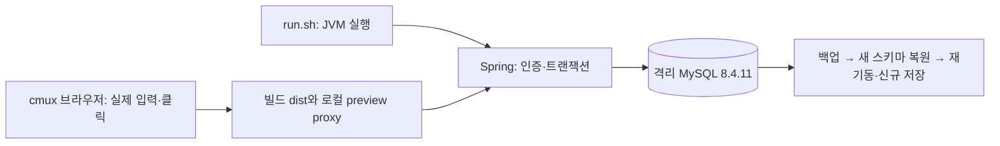

# 배포 런타임·데이터 검증 실행 기록

2026-10-05 시작, 2026-10-06 로컬 범위 완료. [릴리스 테스트 계획](../../plans/deployment-test-plan.md).
로컬 실행 당시 사용자 결정: **클라우드는 추후 결정하고 로컬 준비와 검증부터 마무리한다.** 이후 Google Cloud로 결정했고 관리형 구성은 후보로 계획한다. 사용자는 이전 로컬 작업의 GitHub 반영을 우선하도록 요청했다.

Phase는 배포 런타임·데이터 검증, 양쪽 브랜치는 `refactor/deployment-runtime-and-data-verification`이다.
worktree는 `/Users/seungmin/Desktop/repo/archive/demp/.worktrees/deployment-runtime-and-data-verification/{backend,frontend}`.
로컬 검증의 기준 HEAD는 B `d6a3146ffa9d7491acdcabfd5665afc710798f14`, F `7f63e0640216ba5486d9af79c454d56e47565682`이다. 당시 백엔드의 시작 스크립트·테스트·문서는 미커밋 상태였으며 보존된 JSON은 그 회차의 관찰 기록이다. GitHub 전달 전 아래 재검증을 진행했고 이 변경을 PR로 전달한다. 프런트 소스는 변경하지 않았다. 실제 클라우드 생성·배포는 수행하지 않았다.

## 1. 검증 순서와 책임

`run.sh`는 설정과 산출물을 JVM에 전달한다. 회원·질문·반응·권한 판단은 기존 Controller/Service/Domain이 계속 소유한다. DB는 commit·제약·잠금·보존을 맡으며 검증 스크립트는 HTTP와 별도 SQL 연결에서 결과를 관찰한다. 저장소 provider 변경은 이번 로컬 범위에 포함하지 않았다.

cmux 환경 workspace ID와 `cmux identify --json` caller가 `workspace:3 / surface:3`으로 일치했다. `CMUX_SURFACE_ID`는 없어서 identify의 caller를 사용했다. 다른 workspace의 시각적 포커스를 대상으로 삼지 않았다. 오른쪽 helper `pane:6 / surface:6`을 `--focus false`로 한 번 만들고 모든 runner/server send에 `--workspace workspace:3 --surface surface:6`을 명시했다. 같은 pane의 브라우저 `surface:8`에서 실제 입력·클릭·reload를 진행했으며 실행 종료 당시 pane과 브라우저를 남겼다. GitHub 전달 전 확인 시 그 helper는 없어서 같은 caller workspace 오른쪽에 `pane:10 / surface:11`을 `--focus false`로 만들고 공용 백엔드 verify를 표시했다.

## 2. 실행 결과

| 검증 | 정확한 진입 명령/동작 | 실제 결과 | 경계 |
|---|---|---|---|
| T01 백엔드 | Java 25 `JAVA_HOME` 지정 후 `bash scripts/verify.sh` | 종료 0, Python 21개, Java 333개·필수 suite 55개, 실패/오류/skip 0 | 공용 API 흐름의 DB는 H2 |
| T01 프런트 | Node 24.21.0, `npm ci`, Chromium 준비, `npm run verify -- --headed` | 종료 0, unit 204개·Playwright 160개; contracts/typecheck/lint/build 모두 0 | 자동 E2E는 API fixture; npm audit 0 vulnerabilities |
| T02/T03 로컬 기동 | 실행 가능한 `./run.sh`로 현재 JAR 실행; 누락/31/32 UTF-8바이트 JWT | 정상 기동·로그인; 잘못된 키는 비밀 원문 없이 기동 거부 | 클라우드 기동·실제 운영 키는 미검증 |
| T04~T08 MySQL | `python3 docs/verification/deployment-runtime-and-data-verification/mysql_rehearsal.py` | 종료 0, assertion **53개** | 저장소 legacy fixture를 MySQL로 번역한 격리 DB, 운영 dump 아님 |
| T15/T17 로컬 계약 | 허용/미허용 Origin 로그인; DB 역할 부여·회수 후 동일 JWT | 200/403; 미인증401·일반 회원403·관리자200·즉시 회수403 | 임시 QA 역할은 제거; 운영 관리자 준비 완료로 계산하지 않음 |
| T20~T22 브라우저 | 회원가입→로그인→질문/태그/Markdown→답변→reload; 반응 전환/취소/별도 답변 추천→reload | 실제 Spring/MySQL 저장과 작성자·본문·선택 일치; 별도 SQL 연결로 재확인 | API mock 없음; 이 표는 각 전체 클라우드 시나리오의 일부 |
| T24 화면·키보드 | 390×844/1440×1000px; Space 선택·다시 포커스 후 취소 | 가로 넘침 없음, 실제 저장 성공 | 저장 중 disabled 버튼은 포커스를 잃음; 연속 키 조작에 재포커스 필요 |
| T26 로그 일부 | 알려진 합성 DB/S3/JWT 값과 발급 토큰을 수집 로그에서 대조 | 알려진 비밀 원문 없음 | 실제 운영 로그·5xx 감지/모니터링은 미검증 |

MySQL 이미지는 `mysql:8.4`의 digest `sha256:6ea90827b1100f8f2ae306a539f86d2c264a26ed435a2a9f75551dd5c3aeb242`, 실제 버전은 8.4.11이다. 컨테이너 `demp-release-mysql-20261005`는 `demp.verification=release-20261005` 소유 라벨과 loopback 포트만 사용한다. 실행마다 새 `demp_release_<시각>` 스키마를 만들며 이전 시도 DB를 덮어쓰거나 수동 SQL을 중복 적용하지 않는다. 새 서버 인스턴스가 아닌 **같은 격리 인스턴스의 별도 스키마**로 복원했다.

확인한 데이터 경로: 수동 SQL 5개 실제 적용 → validate 성공 → 기존 태그/공고 금액·enum·날짜/NULL 보존 → member/question ID 1001부터 저장 → 질문/답변 작성자 및 한글 저장 → 같은 반응 재전송/전환/취소 → 두 회원의 12개 동시 요청이 정확히 2회 집계 → UNIQUE/FK/대상/value CHECK 거절 → JVM 재시작 보존·seed 없음 → dump/restore의 모든 테이블 행 해시 일치 → 복원 DB 읽기와 ID 1002 신규 저장. 필수 컬럼이 빠진 별도 스키마는 기동 거부됐다.

백엔드 build 30초, 프런트 전체 verify 약 80초는 해당 러너의 관찰값이다. 환경 준비·결함 조사·화면 절차의 전체 소요시간과 버퍼 사용량은 별도 계측하지 않았으므로 임의의 확정 시간으로 기록하지 않는다. 30h 계획 중 클라우드 절차 대부분은 아직 실행하지 않았다.

### GitHub 전달 전 재검증

Java 25의 `JAVA_HOME`을 지정한 `bash scripts/verify.sh`를 현재 백엔드 worktree에서 재실행했다. `workspace:3 / surface:11`에 명령과 로그를 표시했고 종료 0, Python 21개·Java 333개·필수 suite 55개, 실패/오류/skip 0, 생성 문서/JAR/HTTP 일치와 실제 H2 API 저장·재조회를 확인했다. build는 이 회차에서 28초였다. [전달 전 결과](evidence/publication-preflight.json). 원시 로그·종료 파일은 `/private/tmp/demp-release-20261005/github-preflight.{log,exit}`다. 프런트와 MySQL·실제 브라우저 결과는 위 로컬 회차의 기존 증거이며 이 전달 단계에서 새로 실행한 것으로 계산하지 않는다.

## 3. 시작 명령 변경: Red → Green → Refactor

- **Red:** `python3 -m unittest discover -s scripts -p 'test_launch.py' -v`, 종료 1. 5개 테스트/7개 assertion 실패. 기본 포트가 비어 있고, JAR 경로/앱 인자·프로필을 전달하지 못하며, JVM PID가 launcher PID와 달랐다. 누락 JAR/잘못된 포트도 JVM 실행 전 거절하지 않았다. JVM fixture는 실제 로컬 실행 파일이므로 Qoddi 미설치 오류를 기능 Red로 삼지 않았다. [실패 로그](evidence/launch-red.log).
- **Green:** [run.sh](../../../run.sh)에 shebang·실행 권한·8080/prod 기본값·산출물/포트 검사·`DEMP_JAR_PATH`·JVM/앱 인자 전달·`exec`를 추가했다. Qoddi buildpack 변경 및 `SECURE_FILE` 파일 생성은 제거했다. 대상 5개 모두 통과, 종료 0. [통과 로그](evidence/launch-green.log).
- **Refactor:** 시작 스크립트의 책임은 JVM 실행으로 한정했다. `project_root`/`jar_path`/`port`/`java_command`가 실제 입력과 효과를 드러낸다. 기존 Procfile의 `web: ./run.sh` 공개 시작 계약을 유지하며 실제 MySQL 기동도 이 명령으로 재검증했다. 새 도메인 규칙·위임 객체는 추가하지 않았다.
- 최소 구현 중 macOS Bash 3.2에서 빈 배열+`set -u`가 기본 기동을 거절하는 것을 대상 테스트가 발견했다. 빈 옵션 배열 대신 항상 JVM 명령이 들어 있는 배열로 고친 뒤 대상·공용 전체 검증과 실제 MySQL을 재실행했다.
- 테스트는 private 구현·옵션 순서 대신 실제 argv, 파일 부작용, 프로세스 ID/종료 코드, 잘못된 입력 거절을 확인한다. 새 Python 테스트는 기존 공용 verify의 discovery로 실행된다. Java/프런트 객체·JSON/DB 컬럼/라우트 계약을 바꾸지 않았다. 새 TypeScript 코드와 SOLID 판정 대상은 없다.

## 4. 실패·환경 문제와 해소

초기 Docker 임시 socket 서버를 readiness로 오인해 fixture 연결이 실패했다. TCP readiness로 수정했다. 문자열 `ok` 응답의 JSON 파싱 및 zsh에서 bash `PIPESTATUS`를 사용한 검증 코드 오류도 바로잡았다. SQL fixture의 잘못된 `JOB` enum은 실제 `EMP/EDU` 계약으로 수정하고 HTTP 공고 조회/날짜/복원 후 저장 검증을 추가했다. 마지막 증거 수집은 프런트 summary의 실제 `success` 필드에 맞췄다. 이 문제들을 앱 결함의 Red/통과로 계산하지 않는다.

실제 브라우저 로그인은 최초 403이었다. preview 주소 `http://127.0.0.1:5057`의 Origin이 기본 허용 목록 `http://localhost:5050`에 없었다. 해당 리허설 주소를 `APP_CORS_ALLOWED_ORIGINS`에 주입한 뒤 동일 브라우저 로그인은 200, 다른 Origin은 403이었다. 운영 reverse proxy의 Origin/Host 전달 방식은 별도 검증한다. cmux의 WKWebView는 `network requests` 조회를 지원하지 않아 요청 상태만 관찰하는 XHR 계측을 한 번 사용했으며 응답을 바꾸거나 mock하지 않았다.

일부 cmux/socket·loopback·프로세스 조회가 sandbox에서 거절되어 해당 명령만 권한 승격으로 재실행했다. 공용 Gradle deprecated/Gradle 10 호환 안내 및 open-in-view/SpringDoc 기본 활성화 안내는 관찰된 경고로 남긴다. 현재 Gradle 9.8/Java 25의 필수 검증 실패는 없다.

## 5. 증거와 재실행 경계

[실행 요약과 해시](evidence/execution-summary.json), [백엔드 실제 API 결과](evidence/backend-runtime.json), [프런트 전체 결과](evidence/frontend-summary.json), [MySQL assertion 목록](evidence/mysql-result.json), [MySQL 실행 로그](evidence/mysql-rehearsal.log), [반응·화면 명령 기록](evidence/browser-steps.json), [회원가입·작성 명령 기록](evidence/browser-creation.json).

[390px](evidence/mysql-browser-390.png) · [1440px](evidence/mysql-browser-1440.png) · [브라우저 작성 후 새로고침](evidence/mysql-browser-created.png). 브라우저 기록의 합성 비밀번호 입력은 가렸으며 JWT/DB 자격 증명과 dump는 저장소에 복사하지 않았다.

원시 runner/서버 로그·종료 파일·합성 자격 증명·백업은 `/private/tmp/demp-release-20261005/`에 있다. 자격 증명 파일·dump는 mode 600이다. 백엔드 XML/HTML은 `build/test-results/test/`와 `build/reports/tests/test/`, 프런트는 `.verification/`, `test-results/`, `playwright-report/`다. 이 경로는 로컬 증거이며 CI 업로드/원격 운영 증거가 아니다.

[MySQL 리허설 스크립트](mysql_rehearsal.py)는 이번 소유 컨테이너·Java 경로·private evidence 경로에 맞춘 실행 artifact다. 다른 환경에서는 경로/소유 라벨/합성 자격 증명 준비를 먼저 대조한다. 저장소의 legacy fixture에서 sequence를 MySQL `next_val` 테이블로, CLOB을 LONGTEXT로 번역하므로 실제 운영 스키마 export를 대신하지 않는다. 운영 DB/버킷은 연결하지 않는다.

## 6. 로컬 완료와 다음 작업

로컬 준비·검증은 완료했다. 실제 배포 가능 판정은 아직 하지 않는다. 다음 순서는 **이전 로컬 작업 GitHub 반영 → Google Cloud 구성 확정·전환 구현·비운영 환경 준비 → 기존 DB 복제본/이전 산출물 검증 → 저장소 IAM/URL 및 실제 이미지 수명주기 → HTTPS/API 라우팅 → 운영 관리자·게시 → 배포/롤백·로그·운영 smoke**다.

Cloud Storage 후보의 FileStorage 구현·ADC/IAM·공개 이미지 정책은 계획의 T13에 남아 있다. 현재 구현과 운영 환경변수는 S3 계약이며 합성 S3 설정으로 실제 이미지 저장을 검증했다고 쓰지 않는다. 버튼의 저장 중 포커스 이동도 후속 접근성 점검으로 남긴다. 시작 명령의 기본 JAR 경로·shell 비평가는 리뷰의 별도 실행으로 확인했지만 5개 자동 회귀 테스트가 이 두 조건과 실행 권한을 직접 고정하지 않는 점은 테스트 보강 항목이다. 원본 main의 계획/운영 문서 및 사용자 `docs/interview/`는 보존했다.
