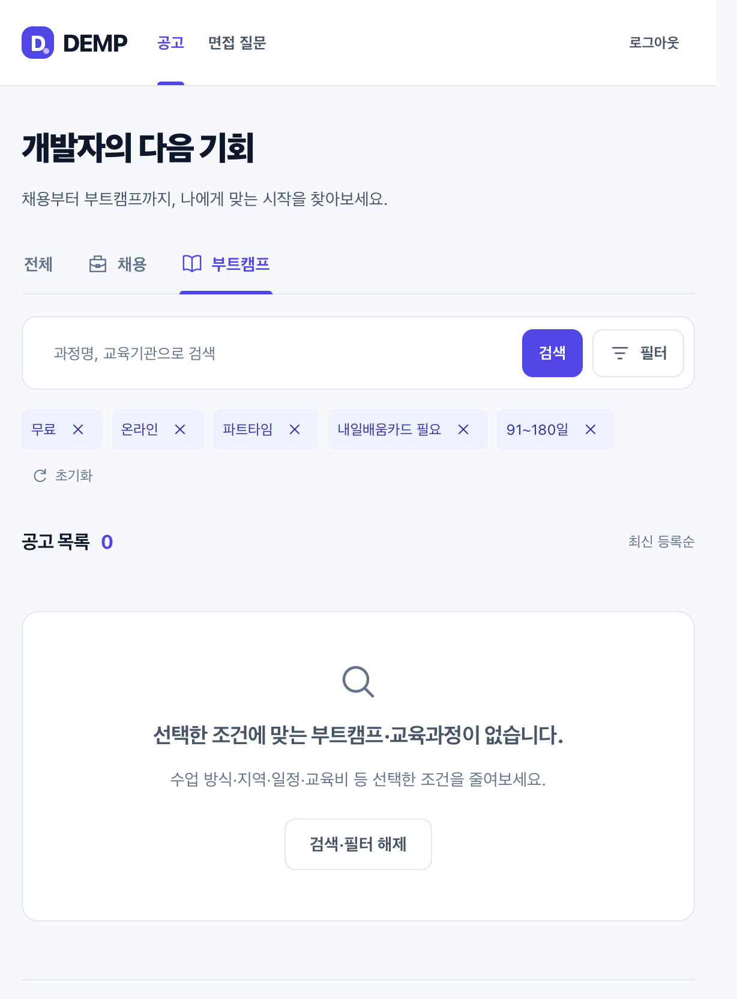

# T90 · 교육 상세 검색과 등록 정보

## 근거와 적용

[부트텐트 조사](../../research/boottent-education-filters.md)를 바탕으로 수업 방식, 지역, 참여 시간, 지원 유형, 선발 방식, 학습 수준, 교육 시작/종료일을 선택 입력한다. 기간은 시작·종료를 포함한 일수로 계산한다. 모집 기간과 교육 기간은 별개다. 무료와 지원 유형도 독립적이다.

```text
EducationFields (등록 입력·이벤트)
    → AnnouncementFields (HTTP 바인딩·검증)
    → EducationDetails (기간 불변식·정보 저장)
    → Announcement (공고 종류와 함께 보존)
        ├→ DTO → 목록/상세 표시
        └→ educationMatches → 목록/무한 스크롤/페이지·건수의 같은 조건

AnnouncementHeader → URL → filtersFromQuery → API → DB 검색
                           ↑ 새로고침·뒤로가기·개별 해제·초기화
```

- 교육 enum/기간의 뜻과 API 계약은 `Announcement-API.adoc`에 기록했다. 새 필드는 nullable이고 기존 공고에 교육 정보를 추정하여 채우지 않는다.
- 기존 `payment`/`accessUrl`/모집 기간 계약은 유지. 명시한 교육 조건은 AND이며 미확인 정보는 매칭되지 않는다. 채용 전환 시 교육 데이터는 제거한다.
- Vue 컴포넌트는 props/event·렌더링에 집중하고, `education.ts`는 옵션/날짜 검증, router 모듈은 URL 허용값, API 모듈은 HTTP 변환을 맡는다. 독립 TS 모듈과 백엔드 객체의 책임·이름/호출부를 검토했다. 새 인터페이스 계층은 만들지 않았다.

## Red → Green → Refactor

- `/tmp/demp-t90-binding-red.log`: 교육 정보 바인딩 계약 미지원 assertion 실패. 이후 테스트 fixture에 EMP/EDU를 중복 전송한 부분과 문자열 교체 오타를 수정했다. 이 준비 오류는 기능 Red로 세지 않았다.
- `/tmp/demp-t90-query-red.log`: 실제 저장 데이터에서 필터 교집합/각 조건이 미적용되어 2개 assertion 실패. Green은 여섯 enum, 개강일 경계, 4개 일수 구간의 공유 `educationMatches`를 모든 목록/페이지·카운트에 적용.
- `/tmp/demp-t90-filters-red.log`: URL의 교육 조건이 API에 전달되지 않는 assertion 실패. Green은 URL 파싱/칩/모드 전환·초기화/API 전달.
- 프런트 폼 첫 시도는 mock에 없는 PUT을 사용한 준비 오류였다. PATCH로 바로잡고 변경 전 폼에 대해 다시 실행한 `/tmp/demp-t90-form-red-corrected.log`에서 입력 요소 부재 실패, 변경 후 `/tmp/demp-t90-form-green.log` 통과.
- 리뷰 발견 1: EMP→EDU 변경 시 기존 타입으로 검사해 교육 정보를 버림. `/tmp/demp-t90-conversion-red.log` 실패 후 새 종류 적용 다음 교육 정보 적용으로 순서 수정. 양방향 변경 검증.
- 리뷰 발견 2: 협의·미공개와 함께 남은 상한 값이 validation은 통과하고 도메인에서 예외. `/tmp/demp-t90-salary-red.log` 2개 실패 후 숨김 금액을 먼저 제거하도록 정상화.
- 공고 종류 변경 시 연봉이 교육비로 옮겨지는 문제는 `/tmp/demp-t90-payment-switch-red.log`로 재현 후 사용자 타입 변경 이벤트에서 금액/상한/상태 초기화. 서버 재조회 로딩은 초기화 이벤트를 발생시키지 않아 저장값 유지.
- Refactor: 교육 조건 조합은 한 함수로 공유하고 옵션/한글 표시는 한 TS 모듈을 사용한다. 원문 데이터 미확인을 임의 값으로 바꾸는 기본값을 추가하지 않았다.

## 최종 검증

| 범위 | 결과 | 로그 |
| --- | --- | --- |
| B 전체 test + asciidoctor + bootJar | 253개, 실패/오류/skip 0, 성공 | `/tmp/demp-t90-back-reviewed.log` |
| F 전체 unit | 141개 통과 | `/tmp/demp-t90-unit-final.log` |
| F typecheck / lint / build | 모두 종료 0 | `/tmp/demp-t90-{types,lint,build}-final.log` |
| headed Playwright | 18개 통과, 종료 0 | `/tmp/demp-t90-e2e-final.log` |

초기 전체 F 실패 1건은 기존 빈 결과 안내 문구를 기대한 assertion이었다. 확장한 교육 조건 안내 문구로 갱신했고, 교육 수업 방식만 선택한 빈 결과 사례를 추가했다.

### 실제 cmux 인수

- 호출 workspace 확인: env UUID `513D2093-E1D4-4C99-AF65-3881B6CC5499`, identify caller workspace:2/surface:3. 보조 pane:9의 terminal:12/browser:13 재사용.
- 실행 worktree는 Phase10. Spring 18080(H2 메모리, 로컬 파일), Vue 5050. 러너/서버 명령·로그는 terminal12에서 실행. Playwright API mock 테스트와 아래 실제 서버 흐름을 구분한다.
- 실제 관리자 폼에서 교육과정 등록(6개 조건, 2026-10-01~12-31, 교육비 미확인) → 관리자 재조회 값 보존 확인.
- 온라인+파트타임+내일배움카드+91~180일 조회에서 해당 과정 1개. 무료를 추가하면 0개이고 구체적인 교육 빈 결과/조건 해제 안내 표시.
- 온라인→혼합 수정 → 혼합 검색 1개 → 상세에 지역/시간/지원/선발/수준과 92일 표시, 교육비 정보 없음 표시.
- 처음에는 접힌 모바일 패널의 DOM에 조건을 설정한 부분이 있어, 이후 모바일 필터와 상세 조건을 실제 펼치고 visible 상태를 확인한 뒤 혼합 조건 선택을 다시 수행했다.
- 사용자가 pane 비율 문제를 지적하여 1280×900 고정 viewport 해제. 현재 614×833 native 크기, 가로 overflow 없음. 신규 select는 WebKit에서도 높이 44px. 앞으로 고정 크기 검증 후 reset한다. 현재 탭은 DEMP 교육 목록이며 외부 조사 탭 추가 없음. E2E 로그 pane 유지.




## 배포 전 적용

T87 본문 첨부 테이블 SQL 외에 `announcement-compensation.sql`, `announcement-education.sql`을 순서대로 적용해야 한다. 자동 migration은 없다. 기존 스키마+SQL 검증은 H2 MySQL 모드에서 수행했으며 운영 MySQL에 실행한 것은 아니다. 기존 0원 데이터는 실제 무료인지 원문 확인 후 운영자가 수정해야 한다.

이 작업은 공고 검수·기관 승인·수집 자동화·기수/지원금 세부 금액을 구현한 것으로 표시하지 않는다. 해당 후속 체크리스트는 유지한다.
